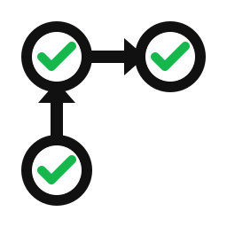
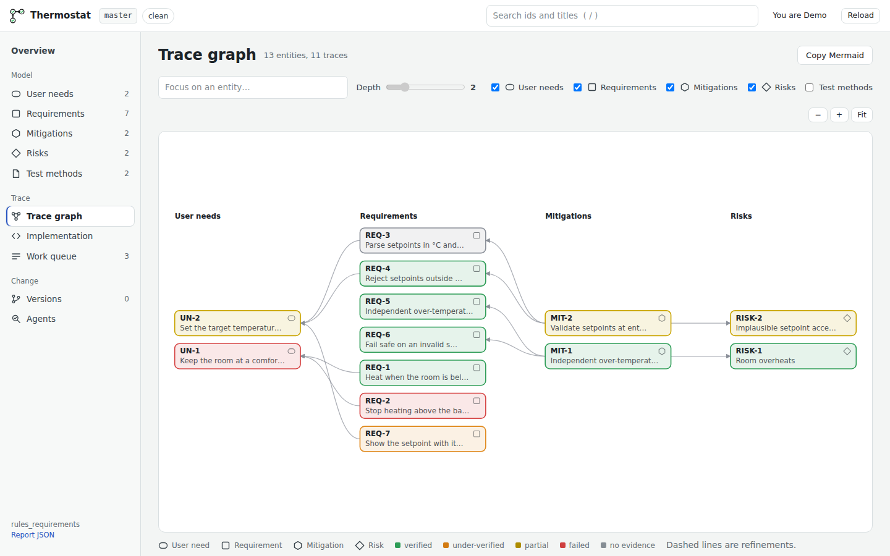

<picture>
  <source media="(prefers-color-scheme: dark)" srcset="docs/_static/logo/rules_requirements_logo-dark.svg">
  
</picture>

# rules_requirements

[](https://github.com/Studio-Fug/rules_requirements/actions/workflows/ci.yaml)
[](https://studio-fug.github.io/rules_requirements/)
[](https://github.com/Studio-Fug/rules_requirements/actions/workflows/docs.yaml)
[](LICENSE)
[](MODULE.bazel)
[](pyproject.toml)

**Requirements-driven development for Bazel projects.** Write down what users
need, what the product must do, what can go wrong and how you control it — then
let your test suites prove it, and get a traceability report that says, for
every item, whether it is *verified the way it needs to be*.

```text
 user needs ──satisfied by──▶ requirements ◀──implemented by── mitigations ──control──▶ risks
    (UN)                         (REQ)                            (MIT)                (RISK)
                                   ▲
                    verified by tests (JUnit), at a demanded rigor (test method / level)
```

The vocabulary follows the design-control and risk-management structure of
**IEC 62304** (medical device software life cycle), **ISO 14971** (risk
management) and **IEC 60601-1** §14 (programmable electrical medical systems),
kept generic enough for any product that wants an auditable V&V argument.

**Documentation: <https://studio-fug.github.io/rules_requirements/>** — concepts,
a tutorial, the standards background, and the model, hooks, Bazel and CLI
reference.

## Features

- **A model you can review in a diff.** YAML files (one big file or one object
  per file) for user needs, requirements (with refinement), risks
  (hazard → harm, severity × likelihood, residual risk), mitigations (risk
  control measures) and test methods. ID prefixes, verification levels,
  severity scales and coverage rules are configurable per project.
- **Validation with stable rule codes** — dangling or inconsistent traces,
  orphaned requirements, unsatisfied needs, uncontrolled risks, unacceptable
  residual risk, typos in field names.
- **Test hooks that emit standard JUnit XML** with traceability properties:
  - pytest — `@pytest.mark.rr("REQ-1", level="hil")`
  - unittest — `@rr.verifies("REQ-1")` + a JUnit-writing runner
  - googletest — `RR_VERIFIES("REQ-1");`
  - Rust — `rr::verifies!("REQ-1");` (with a libtest → JUnit wrapper)
  - anything else — `JUnitWriter` for hand-rolled (e.g. hardware-in-the-loop) harnesses
- **Pluggable evidence ingestion.** JUnit is the standard; Rust libtest output and
  signed-off inspection records are built in, and new formats are one small
  `Ingestor` class (or a `rules_requirements.ingestors` entry point) away.
- **Verification rigor, not just coverage.** Each requirement demands a level
  (`analysis < simulation < sil < hil < hitl`, plus `inspection`); evidence
  provides one. A hardware requirement proven only in simulation is
  **UNDER-VERIFIED**, evidence against an older build is **STALE**, and
  physical evidence without a cheap backing test violates the **cost pyramid**.
- **Reports** in HTML (with a trace graph), Markdown and deterministic JSON —
  suitable for golden tests — plus a typed **gap queue** that routes each gap to
  an agent (`autonomous`) or a human/bench (`human-gate`).
- **Source annotations** — `# @rr(REQ-0001): Implements isolated access to
  secure data` — link requirements to the code that implements them; unknown ids
  fail the build.
- **Hermetic reports in Bazel.** `rr_evidence` runs tests in a build action,
  `rr_report` renders the report, `rr_golden_test` pins it.
- **A web editor with agents** (`rr serve`) — author and edit the model with
  surgical, comment-preserving YAML edits; trace it through a live graph; browse
  to the annotated code; diff the model across branches and tags, name
  baselines, commit; and run agentic reviews (completeness, *does this test
  actually prove this requirement?*, *does this requirement enforce this
  mitigation?*, hazard discovery) whose findings become notes or new entities.
- **Zero runtime dependencies** — pure Python standard library (YAML parsing is
  vendored), so it works with any Python toolchain and pip hub.

## Quick start (Bazel)

```starlark
# MODULE.bazel
bazel_dep(name = "rules_requirements", version = "0.1.0")
git_override(
    module_name = "rules_requirements",
    remote = "https://github.com/Studio-Fug/rules_requirements.git",
    commit = "<sha>",
)
```

```yaml
# requirements/model.yaml
user_needs:
  - id: UN-1
    title: Keep the room comfortable
requirements:
  - id: REQ-1
    title: Turn the heater on below setpoint - hysteresis
    satisfies: [UN-1]
risks:
  - id: RISK-1
    title: Room overheats because the heater is stuck on
    severity: high
    likelihood: possible
mitigations:
  - id: MIT-1
    title: Independent over-temperature cutoff
    mitigates: [RISK-1]
    implemented_by: [REQ-2]
```

```starlark
# BUILD.bazel
load("@rules_requirements//rr:defs.bzl", "rr_evidence", "rr_golden_test", "rr_model", "rr_py_test", "rr_report")

rr_model(name = "model", srcs = glob(["requirements/*.yaml"]))  # + :model_test

rr_py_test(
    name = "controller_test",
    srcs = ["test_controller.py"],
    deps = [":controller", "@pypi//pytest"],
)

rr_evidence(name = "evidence", tests = [":controller_test"])

rr_report(name = "report", model = [":model"], evidence = [":evidence"])

rr_golden_test(name = "report_golden_test", src = ":report.json", golden = "report.golden.json")
```

```python
# test_controller.py
import pytest


@pytest.mark.rr("REQ-1")
def test_heats_below_setpoint(): ...
```

For suites that cannot run in a build action (hardware-in-the-loop), aggregate
the real test logs instead:

```sh
bazel test //...
bazel run @rules_requirements//python:rr -- report \
    --model requirements/ --evidence "$(bazel info bazel-testlogs)" \
    --html report.html --json report.json --queue-out gaps.json
```

## Quick start (pip)

```sh
pip install "rules-requirements @ git+https://github.com/Studio-Fug/rules_requirements"
rr validate requirements/
pytest --junitxml=results.xml -o junit_family=xunit2   # the rr marker auto-registers
rr report --model requirements/ --evidence results.xml --html report.html
```

## The web editor

```sh
rr serve --model requirements/ --evidence bazel-testlogs     # or: bazel run @rules_requirements//python:rr -- serve ...
pip install "rules-requirements[agents]"                    # optional: LLM-backed agent workflows (Claude)
```



Every edit is verified by re-reading the file before it is written, commits
include only model files, and the server is local-only by default (see the
[web editor guide](https://studio-fug.github.io/rules_requirements/guides/web-editor.html)).

## The report

| Status           | Applies to  | Meaning                                                     |
| ---------------- | ----------- | ----------------------------------------------------------- |
| `VERIFIED`       | REQ, MIT    | passing evidence at or above the demanded rigor             |
| `UNDER-VERIFIED` | REQ         | passing evidence, but below the demand — or only stale      |
| `PARTIAL`        | REQ, UN, MIT, RISK | some of what it rolls up is verified                 |
| `FAILED`         | all         | a test for it (or for something it rolls up) failed         |
| `UNVERIFIED`     | REQ, MIT    | no evidence                                                 |
| `VALIDATED` / `UNVALIDATED` | UN | every satisfying requirement verified / none        |
| `MITIGATED` / `OPEN` | RISK   | every mitigation verified / none                            |

## Repository layout

| Path | What |
| ---- | ---- |
| [`python/rules_requirements/`](python/rules_requirements) | the toolkit: model, validation, ingestion, tracing, reports, hooks, CLI |
| [`rr/defs.bzl`](rr/defs.bzl) | Bazel rules and macros |
| [`cc/rr_gtest.h`](cc/rr_gtest.h) | googletest hook (`@rules_requirements//cc:gtest`) |
| [`rust/src/lib.rs`](rust/src/lib.rs) | Rust hook (`@rules_requirements//rust:rr`, crate `rr`) |
| [`schema/`](schema) | JSON Schema for model files (editor completion) |
| [`tests/integration/`](tests/integration) | every hook → evidence → report, pinned by goldens |

## Development

```sh
pip install -e ".[test]" && coverage run -m pytest && coverage report   # unit tests + coverage
bazel test //...                              # everything, including the hook integration goldens
pre-commit run --all-files                    # lints (ruff, mypy, buildifier, codespell, SPDX headers)
pip install -r docs/requirements.txt && python -m sphinx -W -n -b html docs docs/_build/html  # docs
```

## License

[GNU Affero General Public License v3.0 or later](LICENSE). The vendored PyYAML
is MIT-licensed (see `python/rules_requirements/_vendor/yaml/LICENSE`).
